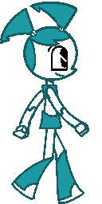

# Desktop Jenny

   

Jenny Wakeman from My Life as a Teenage Robot, right on your desktop!

All included images were drawn by me.

## Capabilities

Jenny can:

- Stare into your soul
- Look at your mouse cursor
- Walk
- Sleep
- Fly with rocket boosters
- Jump down

## Building and running

Run `go run .` in the `xj9` directory to build and run. Run `go build` to get an
executable.

You may need to install extra dependencies if you are on MacOS or Linux. More
information about that [here](https://github.com/faiface/pixel#requirements).
